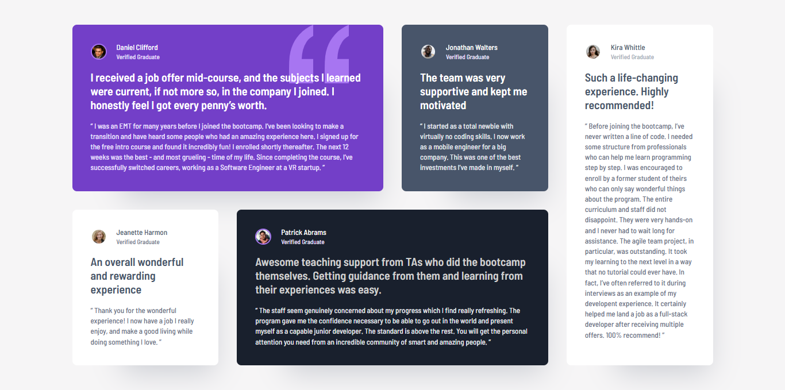

# Frontend Mentor - Testimonials Grid Section

This is a solution to the [Testimonials grid section challenge on Frontend Mentor](https://www.frontendmentor.io/challenges/testimonials-grid-section-Nnw6J7Un7).It's a responsive layout challenge showcasing testimonials in a clean, grid-based design.

## 🚀 Live Site

- **Live URL**: [Add your live site link here](https://mohammed-osama-pg.github.io/FdMr-Testimonials-grid-section/)
- **GitHub Repo**: [Add your GitHub repo link here](https://github.com/Mohammed-Osama-pg/FdMr-Testimonials-grid-section.git)

## 📑 Table of Contents

- [Pre-Project Notes](#-pre-project-notes)
  - [What is the challenge?](#-what-is-the-challenge)
  - [Ideas to test myself](#-ideas-to-test-myself)
  - [Requirements](#-requirements)
  - [Resources & References](#-resources--references)
  - [Time Taken](#-time-taken)
- [Built With](#️-built-with)
- [Screenshot](#-screenshot)
- [What I Learned](#-what-i-learned)
- [Useful Resources](#-useful-resources)
- [Author](#-author)

---

## 📝 Pre-Project Notes

### ❓ What is the challenge?

It is to build out this testimonials grid section and get it looking as close to the design as possible.

**Users should be able to:**

- View the optimal layout for the site depending on the device's screen size.

### 💡 Ideas to test myself

- Write styles using a CSS pre-processor (Sass, Less, or Stylus)
- Practice working in a team by building with friends
- Train my eye for detail by getting the solution as close to the design as possible
- Estimate the time it will take to build the project and compare with the actual time

### 📋 Requirements

- Learning about **CSS Grid Layout**
- Researching how to collaborate and connect with other developers
- Pushing myself to break through insecurity to contect with people.

### 🔍 Resources & References

- [Learn CSS Grid – A 13 Minute Deep Dive](https://youtu.be/EiNiSFIPIQE?si=MACgDrCtSxdPOmq8)

### ⏱️ Time Taken

Approx. **2 hours and 7 minutes** (32m + 25m + 70m)  
_Note: This doesn't include time spent on writing the ReadMe and pre-project notes._

---

## 🛠️ Built With

- HTML5
- Sass (CSS Pre-processor)
- CSS Grid
- Mobile-first design

## 📸 Screenshot

## 💡 What I Learned

This project helped me become more comfortable with CSS Grid and how to create responsive, multi-column layouts. It also made me reflect on the importance of collaboration, and I took the first steps toward learning how to reach out and work with other developers.

## 📚 Useful Resources

- [Sass Documentation](https://sass-lang.com/documentation)
- [CSS Grid Guide by MDN](https://developer.mozilla.org/en-US/docs/Web/CSS/CSS_grid_layout)

## 👤 Author

- GitHub – [Mohammed-Osama](https://github.com/Mohammed-Osama-pg)
- Linkedin – [@Mohammed-Osama](https://www.linkedin.com/in/mohammed-osama-a4124228b)
- Frontend Mentor – [@Mohammed-Osama](https://www.frontendmentor.io/profile/Mohammed-Osama-pg)
